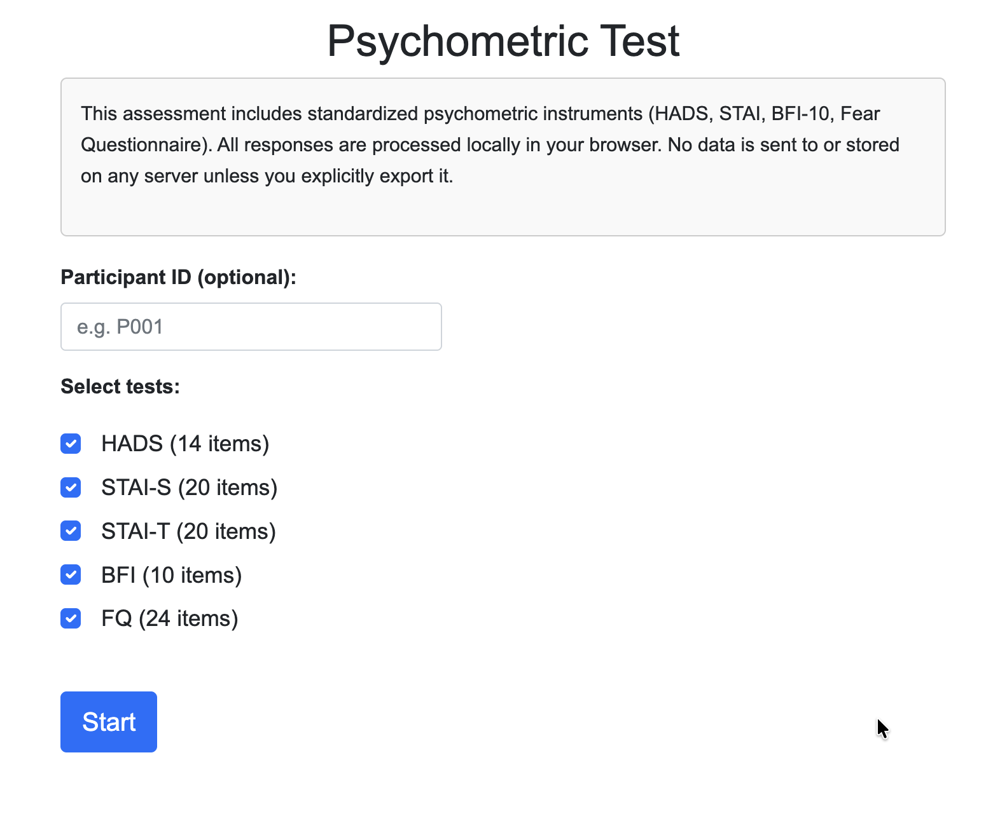
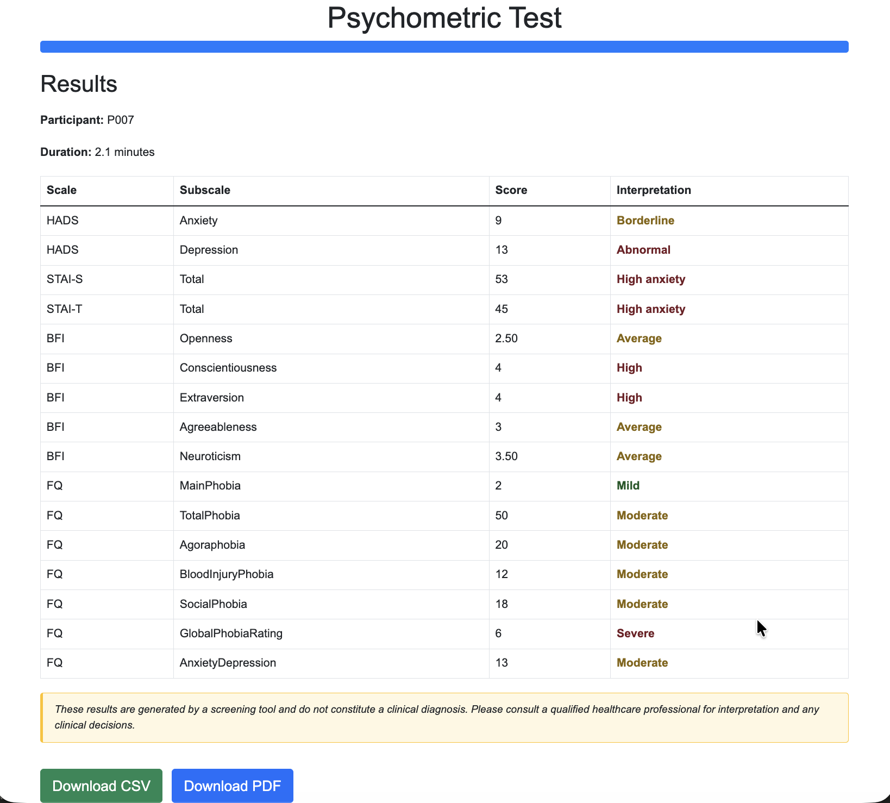
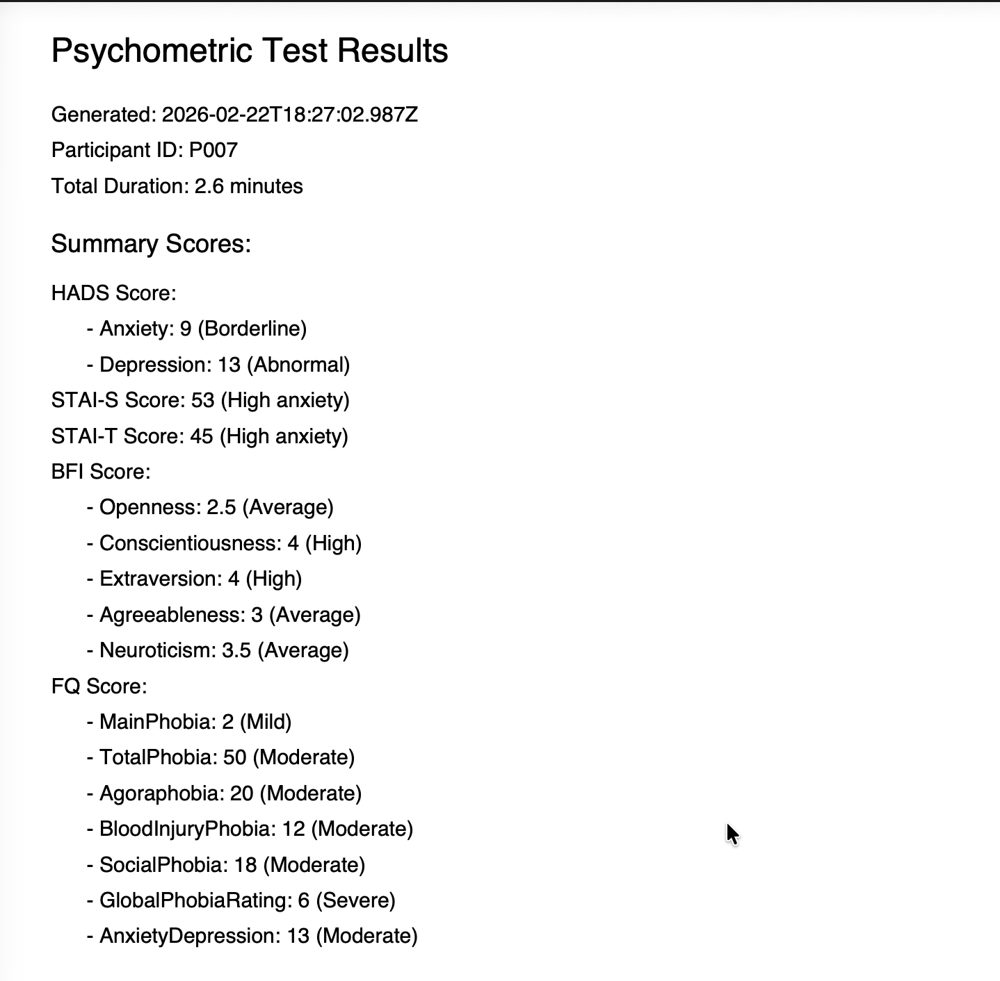
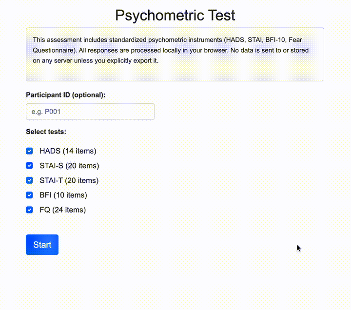

# Psychometric Test Suite (88 Questions)

<div align="center">
  <a href="https://urme-b.github.io/Psychometric/"><strong>Try the Live Demo</strong></a>
</div>

A bilingual (English / French) web app for administering five standardized psychometric instruments with automated scoring, clinical interpretation, and CSV/PDF export. Fully offline, fully private.

## Instruments

| Test | Items | Measures | Subscales | Score Range |
|:-----|:-----:|:---------|:----------|:------------|
| **HADS** | 14 | Hospital Anxiety & Depression | Anxiety, Depression | 0 - 21 per subscale |
| **STAI-S** | 20 | State Anxiety | Current anxiety level | 20 - 80 |
| **STAI-T** | 20 | Trait Anxiety | General anxiety tendency | 20 - 80 |
| **BFI-10** | 10 | Big Five Personality | Extraversion, Agreeableness, Conscientiousness, Neuroticism, Openness | 1.0 - 5.0 per trait |
| **FQ** | 24 | Fear Questionnaire | Agoraphobia, Blood-Injury, Social Phobia, Total | 0 - 120 |

## Features

- **Automated scoring** -- reverse-scoring, subscale sums, trait averages, and clinical thresholds
- **Color-coded results** -- Normal / Borderline / Abnormal labels at a glance
- **CSV + PDF export** -- separate download buttons for analysis and clinical records
- **Bilingual** -- validated English and French translations with locale-specific scoring rules
- **Fully offline** -- all dependencies bundled; runs from `file://` with no server
- **Privacy-first** -- zero data leaves the browser unless explicitly exported
- **Unit tested** -- in-browser test suite verifies all scoring logic

## Screenshots

| Participant Setup | Test In Progress |
|:-----------------:|:----------------:|
|  |  |

| Scoring Results | PDF Report |
|:---------------:|:----------:|
|  |  |

## Demo

<a href="https://github.com/urme-b/Psychometric/raw/main/images/demo.mp4">
  
</a>

> Click the preview above to watch the full demo video.

## Quick Start

```bash
git clone https://github.com/urme-b/Psychometric.git
cd Psychometric
```

Open `en/index.html` (English) or `fr/index.html` (French) in any browser -- no server required.

Or open `index.html` for a language selector that redirects automatically.

## Running Tests

Open `tests/test-scoring.html` (English) or `tests/test-scoring-fr.html` (French) in a browser. All assertions run automatically on page load.

## Data Privacy

All scoring happens client-side in the browser. No response data is sent to or stored on any server unless the participant explicitly exports it.

## References

- Zigmond, A. S. & Snaith, R. P. (1983). The Hospital Anxiety and Depression Scale. *Acta Psychiatrica Scandinavica*, 67(6), 361--370.
- Spielberger, C. D. (1983). *State-Trait Anxiety Inventory for Adults (STAI-AD)*. APA PsycTests.
- Gauthier, J. & Bouchard, S. (1993). Adaptation canadienne-francaise de la forme revisee du State-Trait Anxiety Inventory de Spielberger. *Canadian Journal of Behavioural Science*, 25(4), 559--578.
- Rammstedt, B. & John, O. P. (2007). Measuring personality in one minute or less. *Journal of Research in Personality*, 41(1), 203--212.
- Marks, I. M. & Mathews, A. M. (1979). Brief standard self-rating for phobic patients. *Behaviour Research and Therapy*, 17(3), 263--267.

## Tech Stack

JavaScript (ES5) · HTML5 · CSS3 · Bootstrap 5 · jsPDF · LocalStorage API · Blob API

## Keywords

Psychometrics · Anxiety · Depression · HADS · STAI · BFI-10 · Fear Questionnaire · Clinical Screening · Mental Health · Self-Report · Scoring · Bilingual · Offline-First · Privacy · CSV · PDF

## Related Repos

- [Multimodal-Multisensor](https://github.com/urme-b/Multimodal-Multisensor)
- [Sensor](https://github.com/urme-b/Sensor)

## License

[MIT](LICENSE)
