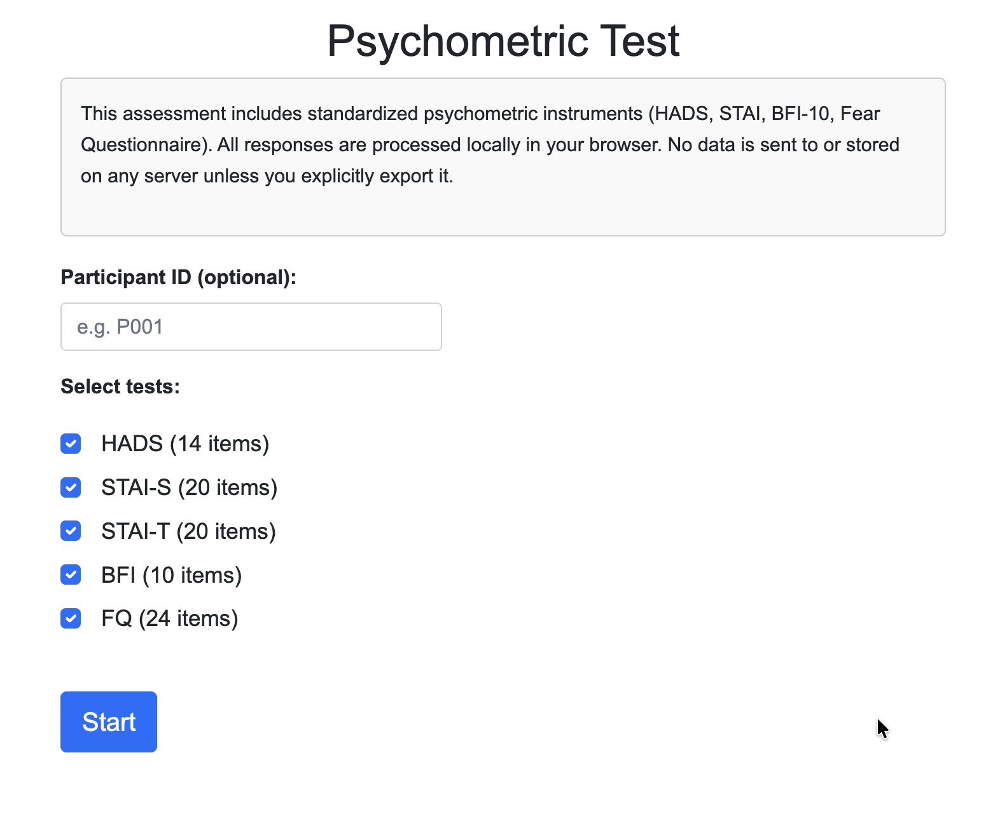
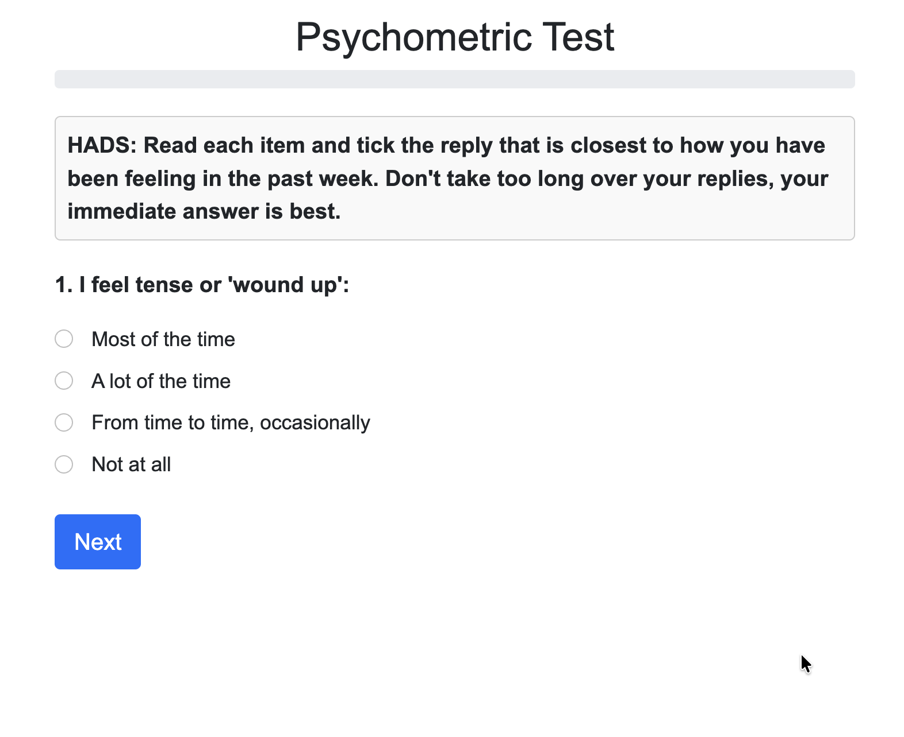
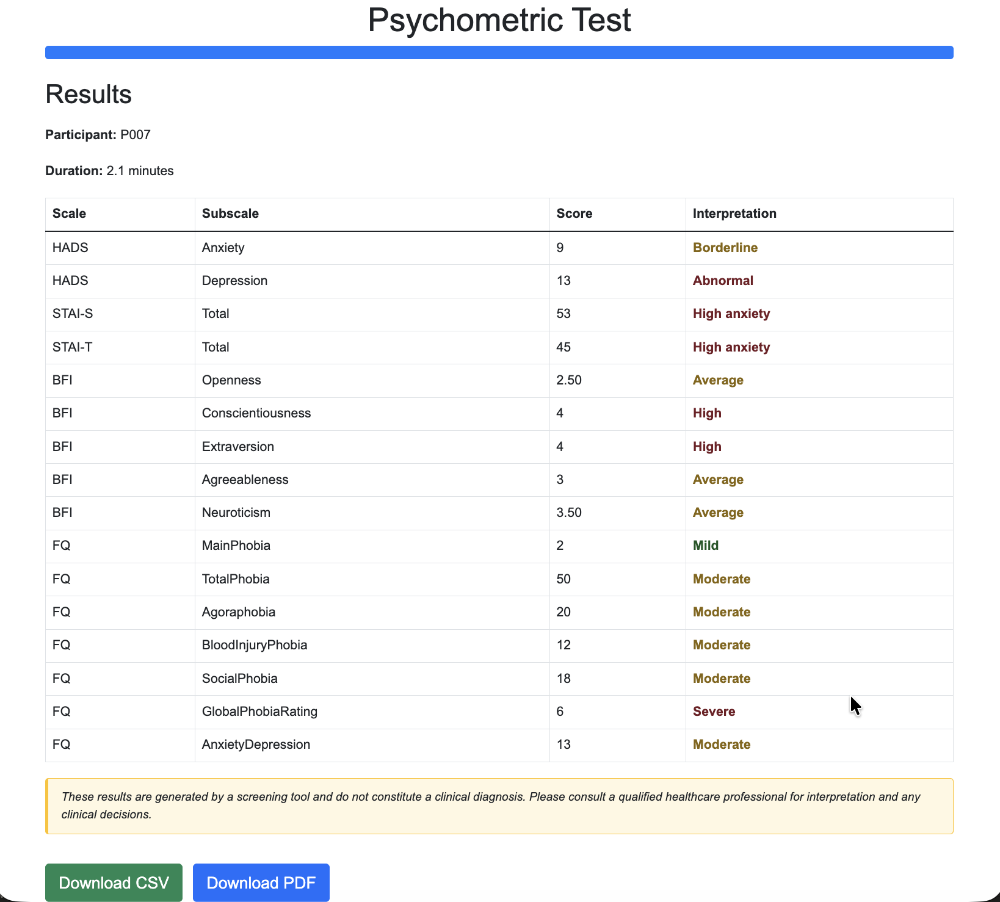
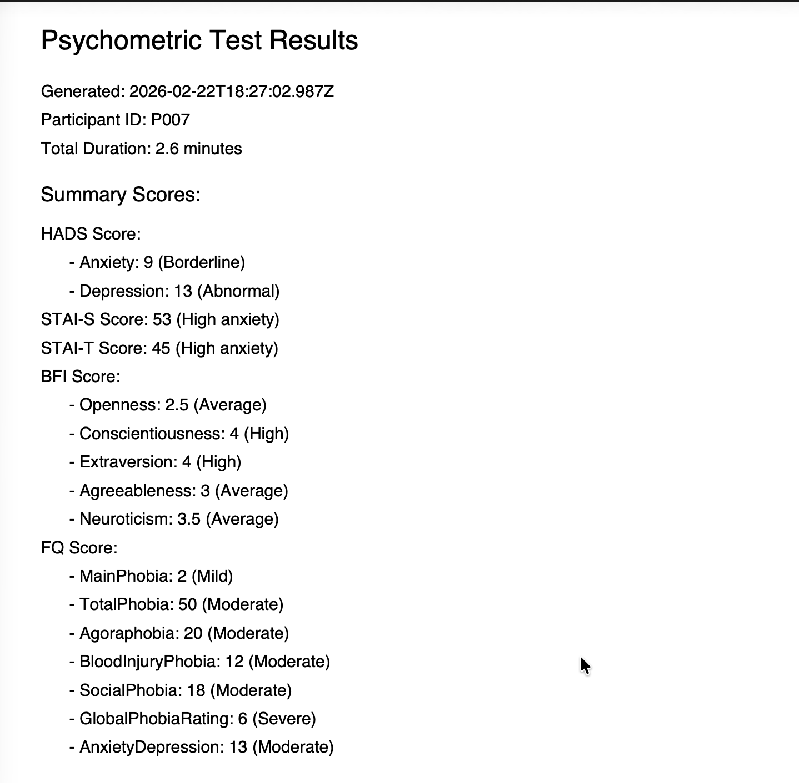
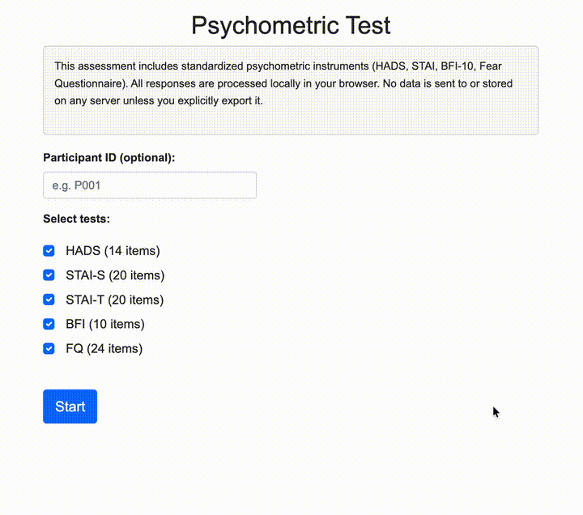

# Psychometric Test Suite (88 Questions)

<div align="center">
  <a href="https://urme-b.github.io/Psychometric/"><strong>Try the Live Demo</strong></a>
</div>

A bilingual (English / French) web app for administering five standardized psychometric instruments with automated scoring, clinical interpretation, and CSV/PDF export. Fully offline, fully private.

> **Disclaimer:** results are produced by a screening tool for research and educational use. They are not a clinical diagnosis; interpretation and any clinical decision require a qualified healthcare professional.

## Instruments

| Test | Items | Measures | Subscales | Score Range |
|:-----|:-----:|:---------|:----------|:------------|
| **HADS** | 14 | Hospital Anxiety & Depression | Anxiety, Depression | 0 - 21 per subscale |
| **STAI-S** | 20 | State Anxiety | Current anxiety level | 20 - 80 |
| **STAI-T** | 20 | Trait Anxiety | General anxiety tendency | 20 - 80 |
| **BFI-10** | 10 | Big Five Personality | Extraversion, Agreeableness, Conscientiousness, Neuroticism, Openness | 1.0 - 5.0 per trait |
| **FQ** | 24 | Fear Questionnaire | Main Phobia, Total Phobia, Agoraphobia, Blood-Injury, Social, Global Rating, Anxiety-Depression | 0 - 120 (Total Phobia); 0 - 40 per phobia subscale |

## Features

- **Automated scoring** -- reverse-scoring, subscale sums, trait averages, and clinical thresholds
- **Color-coded results** -- Normal / Borderline / Abnormal labels at a glance
- **CSV + PDF export** -- separate download buttons for analysis and clinical records
- **Bilingual** -- English and French instrument versions with locale-specific item mappings and reverse-scoring keys (EN Form X-2 / FR Form Y for STAI-T; different FQ item order); clinical thresholds are shared across languages
- **Fully offline** -- all dependencies bundled; runs from `file://` with no server
- **Privacy-first** -- zero data leaves the browser unless explicitly exported
- **Unit tested** -- in-browser test suite verifies all scoring logic

## Scoring

Each instrument uses one of three scoring modes, defined in `lang/*.js`:

- **Total** (STAI-S, STAI-T) -- sum of all 20 items; reverse-worded items are pre-keyed in their option scores.
- **Subscale** (HADS, FQ) -- items summed into named subscales (e.g. HADS Anxiety vs Depression).
- **Trait average** (BFI-10) -- items summed per Big-Five trait, then divided by the trait's item count. Reported relative to the 1--5 scale midpoint (not clinically normed); no severity colour is applied.

Computed scores are mapped to clinical bands (e.g. HADS Normal / Borderline / Abnormal) through per-subscale thresholds and colour-coded in the results table. Item mapping, reverse-scoring direction, and band boundaries are all unit-tested.

## Screenshots

| Participant Setup | Test In Progress |
|:-----------------:|:----------------:|
|  |  |

| Scoring Results | PDF Report |
|:---------------:|:----------:|
|  |  |

## Demo

<a href="https://github.com/urme-b/Psychometric/raw/main/images/demo.mp4">
  
</a>

> Click the preview above to watch the full demo video.

## Quick Start

```bash
git clone https://github.com/urme-b/Psychometric.git
cd Psychometric
```

Open `en/index.html` (English) or `fr/index.html` (French) in any browser -- no server required.

Or open `index.html` for a language chooser.

## Running Tests

**In a browser:** open `tests/test-scoring.html` (English) or `tests/test-scoring-fr.html` (French) -- all assertions run automatically on page load.

**Headless:** the same suites run under Puppeteer.

```bash
npm ci
npm test
```

Every push and pull request runs `npm test` against both languages via GitHub Actions.

## Data Privacy

All scoring happens client-side in the browser. No response data is sent to or stored on any server unless the participant explicitly exports it.

In-progress sessions (participant ID, answers, timestamps) are saved to the browser's `localStorage` so a test survives an accidental refresh. This data never leaves the device: it is cleared automatically when a session completes, can be removed at any time with the **Clear saved data** button, and is replaced when you choose **Start New** on the resume screen.

## References

- Zigmond, A. S. & Snaith, R. P. (1983). The Hospital Anxiety and Depression Scale. *Acta Psychiatrica Scandinavica*, 67(6), 361--370.
- Spielberger, C. D., Gorsuch, R. L. & Lushene, R. E. (1970). *Manual for the State-Trait Anxiety Inventory (Form X)*. Consulting Psychologists Press.
- Spielberger, C. D. (1983). *State-Trait Anxiety Inventory for Adults (STAI-AD)*. APA PsycTests.
- Gauthier, J. & Bouchard, S. (1993). Adaptation canadienne-française de la forme révisée du State-Trait Anxiety Inventory de Spielberger. *Canadian Journal of Behavioural Science*, 25(4), 559--578.
- Bergua, V., Meillon, C., Potvin, O., Bouisson, J., Le Goff, M., Rouaud, O., ... Amieva, H. (2012). The STAI-Y trait scale: psychometric properties and normative data from a large population-based study of elderly people. *International Psychogeriatrics*, 24(7), 1163--1171.
- Rammstedt, B. & John, O. P. (2007). Measuring personality in one minute or less. *Journal of Research in Personality*, 41(1), 203--212.
- Marks, I. M. & Mathews, A. M. (1979). Brief standard self-rating for phobic patients. *Behaviour Research and Therapy*, 17(3), 263--267.
- Cottraux, J., Bouvard, M. & Messy, P. (1987). Validation et analyse factorielle d'une échelle de phobies. La version française du questionnaire des peurs de Marks et Mathews. *L'Encéphale*, 13(1), 23--29.

## Instrument Copyright

The MIT license covers the software only. The instruments are copyright of their respective owners and require appropriate permission to administer -- STAI (Mind Garden) and HADS (GL Assessment) are commercial and require a purchased license. See [NOTICE.md](NOTICE.md) before deploying.

## Tech Stack

JavaScript (ES5) · HTML5 · CSS3 · Bootstrap 5 · jsPDF · LocalStorage API · Blob API

## Keywords

Psychometrics · Anxiety · Depression · HADS · STAI · BFI-10 · Fear Questionnaire · Clinical Screening · Mental Health · Self-Report · Scoring · Bilingual · Offline-First · Privacy · CSV · PDF

## Related Repos

- [Multimodal-Multisensor](https://github.com/urme-b/Multimodal-Multisensor)
- [Sensor](https://github.com/urme-b/Sensor)

## License

Software: [MIT](LICENSE). Instruments: copyright of their respective owners -- see [NOTICE.md](NOTICE.md).
